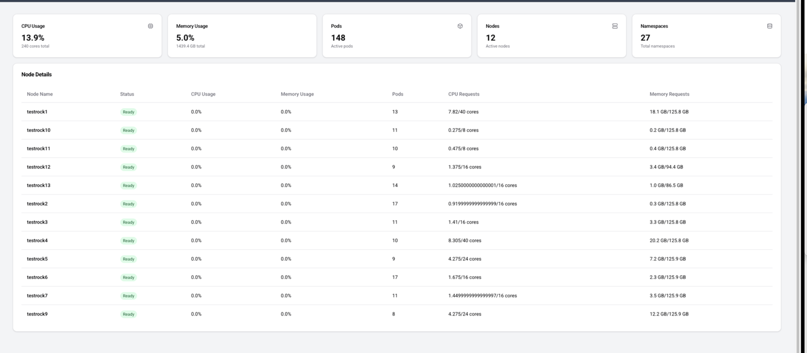

# 🌐  Kube Cloud   

🚀 I'm working more with Kubernetes and building a abstract set of REST services for interacting with the cluster in more abstract ways, this is also powering a web app in a different project. 

## **⚡ Why This Matters**
Kubernetes is powerful, but **operating and deploying services in a cloud-native environment is complex**.  
This platform is designed to **reduce operational friction** and provide:  

✅ **Seamless Deployments** – Automate and simplify service provisioning.  
✅ **Built-in Authentication & Security** – Enforce access control natively.  
✅ **Service Discovery & Management** – Ensure services register dynamically and are easily discoverable.  
✅ **API Gateway for Dynamic Routing** – Easily connect and manage microservices.  
✅ **Cloud-Native Abstraction** – A structured way to manage distributed workloads.  

---

## **🚀 Screensdhot**

✅ **Deploy managed services like Kafka, Redis, MySQL, Elasticsearch**  
✅ **Scale infrastructure dynamically with built-in auto-healing**  
✅ **Provide a self-service developer portal for managing cloud services**  
✅ **Introduce an intuitive UI to monitor and control Kubernetes workloads**  

As this platform evolves, we aim to **bridge the gap between DevOps and developers**, providing a **centralized control plane** that enables teams to focus on **building applications, not managing infrastructure.**  

This is just the beginning. Join us in **redefining Kubernetes service management**. 🚀  
